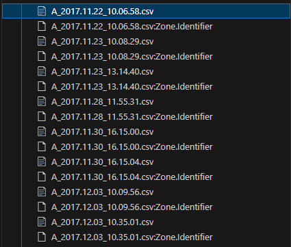

## :Zone.Identifier files

Deleting `:Zone.Identifier` file created by Windows for security purpose



## Verbose Output Compression

Using the -v (verbose) option, which will show the compression process and the amount of space saved.

```sh
    gzip -vk *.csv
```
